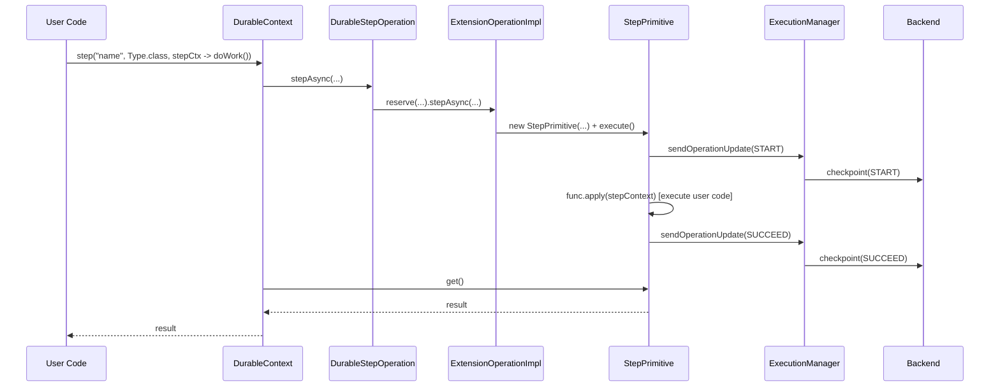
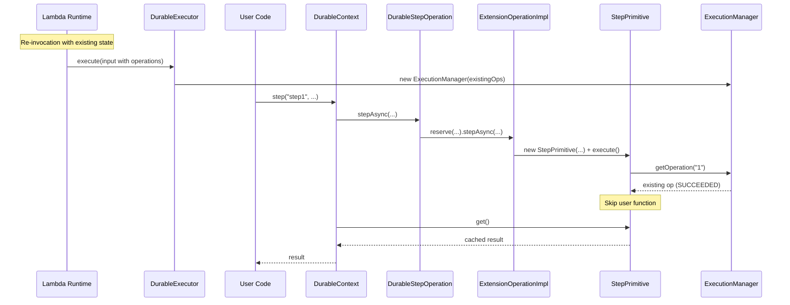
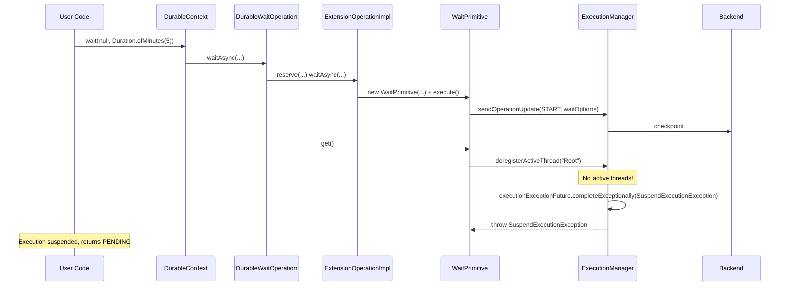

# AWS Lambda Durable Execution Java SDK - Internal Design

> **Note:** This document is for SDK developers and contributors. For user-facing documentation, see the [README](../README.md).

## Overview

This document explains the internal architecture, threading model, and extension points to help contributors understand how the SDK works under the hood. Core design decisions and advanced concepts are further outlined in the [Architecture Decision Records](adr/).

## Module Structure

```
aws-durable-execution-sdk-java/
├── sdk/                      # Core SDK - DurableHandler, DurableContext, operations
├── sdk-testing/              # Test utilities for local and cloud testing
├── sdk-integration-tests/    # Integration tests using LocalDurableTestRunner
└── examples/                 # Real-world usage patterns as customers would implement them
```

| Module | Purpose | Key Classes |
|--------|---------|-------------|
| `sdk` | Core runtime - extend `DurableHandler`, use `DurableContext` for durable operations | `DurableHandler`, `DurableContext`, `DurableExecutor`, `ExecutionManager` |
| `sdk-testing` | Test utilities: `LocalDurableTestRunner` (in-memory, simulates re-invocations and time-skipping) and `CloudDurableTestRunner` (executes against deployed Lambda) | `LocalDurableTestRunner`, `CloudDurableTestRunner`, `LocalMemoryExecutionClient`, `TestResult` |
| `sdk-integration-tests` | Dogfooding tests - validates the SDK using its own test utilities. Separate module keeps dependencies acyclic: `sdk` → `sdk-testing` → `sdk-integration-tests`. | Test classes only |
| `examples` | Real-world usage patterns as customers would implement them, with local and cloud tests | Example handlers, `CloudBasedIntegrationTest` |

---

## API Surface

### User-Facing (DurableContext)

```java
// Synchronous step (func receives a StepContext)
T step(String name, Class<T> type, Function<StepContext, T> func)
T step(String name, Class<T> type, Function<StepContext, T> func, StepConfig config)
T step(String name, TypeToken<T> type, Function<StepContext, T> func)
T step(String name, TypeToken<T> type, Function<StepContext, T> func, StepConfig config)

// Asynchronous step
DurableFuture<T> stepAsync(String name, Class<T> type, Function<StepContext, T> func)
DurableFuture<T> stepAsync(String name, Class<T> type, Function<StepContext, T> func, StepConfig config)
DurableFuture<T> stepAsync(String name, TypeToken<T> type, Function<StepContext, T> func)
DurableFuture<T> stepAsync(String name, TypeToken<T> type, Function<StepContext, T> func, StepConfig config)

// Wait
Void wait(String name, Duration duration)

// Asynchronous wait
DurableFuture<Void> waitAsync(String name, Duration duration)
    
// Invoke
T invoke(String name, String functionName, U payload, Class<T> resultType)
T invoke(String name, String functionName, U payload, TypeToken<T> resultType)
T invoke(String name, String functionName, U payload, Class<T> resultType, InvokeConfig config)
T invoke(String name, String functionName, U payload, TypeToken<T> resultType, InvokeConfig config)

DurableFuture<T> invokeAsync(String name, String functionName, U payload, Class<T> resultType)
DurableFuture<T> invokeAsync(String name, String functionName, U payload, Class<T> resultType, InvokeConfig config)
DurableFuture<T> invokeAsync(String name, String functionName, U payload, TypeToken<T> resultType)
DurableFuture<T> invokeAsync(String name, String functionName, U payload, TypeToken<T> resultType, InvokeConfig config)

// Callback
DurableCallbackFuture<T> createCallback(String name, Class<T> resultType)
DurableCallbackFuture<T> createCallback(String name, Class<T> resultType, CallbackConfig config)
DurableCallbackFuture<T> createCallback(String name, TypeToken<T> resultType)
DurableCallbackFuture<T> createCallback(String name, TypeToken<T> resultType, CallbackConfig config)

// Wait for callback (combines callback creation + submitter step)
T waitForCallback(String name, Class<T> resultType, BiConsumer<String, StepContext> func)
T waitForCallback(String name, TypeToken<T> resultType, BiConsumer<String, StepContext> func)
T waitForCallback(String name, Class<T> resultType, BiConsumer<String, StepContext> func, WaitForCallbackConfig config)
T waitForCallback(String name, TypeToken<T> resultType, BiConsumer<String, StepContext> func, WaitForCallbackConfig config)

DurableFuture<T> waitForCallbackAsync(String name, Class<T> resultType, BiConsumer<String, StepContext> func)
DurableFuture<T> waitForCallbackAsync(String name, TypeToken<T> resultType, BiConsumer<String, StepContext> func)
DurableFuture<T> waitForCallbackAsync(String name, Class<T> resultType, BiConsumer<String, StepContext> func, WaitForCallbackConfig config)
DurableFuture<T> waitForCallbackAsync(String name, TypeToken<T> resultType, BiConsumer<String, StepContext> func, WaitForCallbackConfig config)

// Child context
T runInChildContext(String name, Class<T> resultType, Function<DurableContext, T> func)
T runInChildContext(String name, TypeToken<T> resultType, Function<DurableContext, T> func)
T runInChildContext(String name, Class<T> resultType, Function<DurableContext, T> func, RunInChildContextConfig config)
T runInChildContext(String name, TypeToken<T> resultType, Function<DurableContext, T> func, RunInChildContextConfig config)

DurableFuture<T> runInChildContextAsync(String name, Class<T> resultType, Function<DurableContext, T> func)
DurableFuture<T> runInChildContextAsync(String name, TypeToken<T> resultType, Function<DurableContext, T> func)
DurableFuture<T> runInChildContextAsync(String name, Class<T> resultType, Function<DurableContext, T> func, RunInChildContextConfig config)
DurableFuture<T> runInChildContextAsync(String name, TypeToken<T> resultType, Function<DurableContext, T> func, RunInChildContextConfig config)

// Map
MapResult<O> map(String name, Collection<I> items, Class<O> resultType, MapFunction<I, O> function)
MapResult<O> map(String name, Collection<I> items, Class<O> resultType, MapFunction<I, O> function, MapConfig config)
MapResult<O> map(String name, Collection<I> items, TypeToken<O> resultType, MapFunction<I, O> function)
MapResult<O> map(String name, Collection<I> items, TypeToken<O> resultType, MapFunction<I, O> function, MapConfig config)

DurableFuture<MapResult<O>> mapAsync(String name, Collection<I> items, Class<O> resultType, MapFunction<I, O> function)
DurableFuture<MapResult<O>> mapAsync(String name, Collection<I> items, Class<O> resultType, MapFunction<I, O> function, MapConfig config)
DurableFuture<MapResult<O>> mapAsync(String name, Collection<I> items, TypeToken<O> resultType, MapFunction<I, O> function)
DurableFuture<MapResult<O>> mapAsync(String name, Collection<I> items, TypeToken<O> resultType, MapFunction<I, O> function, MapConfig config)

// Parallel
ParallelDurableFuture parallel(String name)
ParallelDurableFuture parallel(String name, ParallelConfig config)

// Wait for condition
T waitForCondition(String name, Class<T> resultType, BiFunction<T, StepContext, WaitForConditionResult<T>> checkFunc)
T waitForCondition(String name, Class<T> resultType, BiFunction<T, StepContext, WaitForConditionResult<T>> checkFunc, WaitForConditionConfig<T> config)
T waitForCondition(String name, TypeToken<T> resultType, BiFunction<T, StepContext, WaitForConditionResult<T>> checkFunc)
T waitForCondition(String name, TypeToken<T> resultType, BiFunction<T, StepContext, WaitForConditionResult<T>> checkFunc, WaitForConditionConfig<T> config)

DurableFuture<T> waitForConditionAsync(String name, Class<T> resultType, BiFunction<T, StepContext, WaitForConditionResult<T>> checkFunc)
DurableFuture<T> waitForConditionAsync(String name, Class<T> resultType, BiFunction<T, StepContext, WaitForConditionResult<T>> checkFunc, WaitForConditionConfig<T> config)
DurableFuture<T> waitForConditionAsync(String name, TypeToken<T> resultType, BiFunction<T, StepContext, WaitForConditionResult<T>> checkFunc)
DurableFuture<T> waitForConditionAsync(String name, TypeToken<T> resultType, BiFunction<T, StepContext, WaitForConditionResult<T>> checkFunc, WaitForConditionConfig<T> config)

// Lambda context access
Context getLambdaContext()
```

### DurableFuture

```java
T get()                                      // Blocks until complete, may suspend
static <T> List<T> allOf(DurableFuture<T>... futures)  // Collect all results in order
static Object anyOf(DurableFuture<?>... futures)       // Return first completed result
```

### Handler Configuration

```java
public class MyHandler extends DurableHandler<Input, Output> {
    @Override
    protected DurableConfig createConfiguration() {
        return DurableConfig.builder()
            .withLambdaClientBuilder(customLambdaClientBuilder)
            .withSerDes(new CustomSerDes())
            .withExecutorService(Executors.newFixedThreadPool(4))
            .build();
    }
}
```

| Option                | Default                                                                                                                                                                           |
|-----------------------|-----------------------------------------------------------------------------------------------------------------------------------------------------------------------------------|
| `lambdaClientBuilder` | Auto-created `LambdaClient` for current region, primed for performance (see [`DurableConfig.java`](../sdk/src/main/java/software/amazon/lambda/durable/DurableConfig.java))       |
| `serDes`              | `JacksonSerDes`                                                                                                                                                                   |
| `executorService`     | `Executors.newCachedThreadPool()` (for user-defined operations only)                                                                                                              |
| `loggerConfig`        | `LoggerConfig.defaults()` (suppress replay logs)                                                                                                                                  |
| `pollingStrategy`     | Exponential backoff: 1s base, 2x rate, FULL jitter, 10s max                                                                                                                      |
| `checkpointDelay`     | `Duration.ofSeconds(0)` (checkpoint as soon as possible)                                                                                                                          |

### Thread Pool Architecture

The SDK uses two separate thread pools with distinct responsibilities:

**User Executor (`DurableConfig.executorService`):**
- Runs user-defined operations (the code passed to `ctx.step()` and `ctx.stepAsync()`)
- Configurable via `DurableConfig.builder().withExecutorService()`
- Default: cached daemon thread pool

**Internal Executor (`InternalExecutor.INSTANCE`):**
- Runs SDK coordination tasks: checkpoint batching, polling for wait completion
- Dedicated cached thread pool with daemon threads named `durable-sdk-internal-*`
- Not configurable by users

**Benefits of this separation:**

| Benefit | Description |
|---------|-------------|
| **Isolation** | User operations can't starve SDK internals, and vice versa |
| **No shutdown management** | Internal pool uses daemon threads; SDK coordination continues even if the user's executor is shut down |
| **Efficient resource usage** | Cached thread pool creates threads on demand and reuses idle threads (60s timeout) |
| **Daemon threads** | Internal threads won't prevent JVM shutdown |
| **Single configuration point** | Changing `InternalExecutor.INSTANCE` in one place affects all SDK coordination |

**Example: Custom thread pool for user operations:**
```java
@Override
protected DurableConfig createConfiguration() {
    var executor = new ThreadPoolExecutor(
        4, 10,                          // core/max threads
        60L, TimeUnit.SECONDS,          // idle timeout
        new LinkedBlockingQueue<>(100), // bounded queue
        new ThreadFactoryBuilder()
            .setNameFormat("order-processor-%d")
            .setDaemon(true)
            .build());

    return DurableConfig.builder()
        .withExecutorService(executor)
        .build();
}
```

### Step Configuration

```java
context.step("name", Type.class, stepCtx -> doWork(),
    StepConfig.builder()
        .serDes(stepSpecificSerDes)
        .retryStrategy(RetryStrategies.exponentialBackoff(3, Duration.ofSeconds(1)))
        .semanticsPerRetry(AT_MOST_ONCE_PER_RETRY)
        .build());
```

---

## Architecture

```
┌─────────────────────────────────────────────────────────────────────────┐
│                           Lambda Runtime                                │
└─────────────────────────────────────────────────────────────────────────┘
                                    │
                                    ▼
┌─────────────────────────────────────────────────────────────────────────┐
│  DurableHandler<I,O>                                                    │
│  - Entry point (RequestStreamHandler)                                   │
│  - Extracts input type via reflection                                   │
│  - Delegates to DurableExecutor                                         │
└─────────────────────────────────────────────────────────────────────────┘
                                    │
                                    ▼
┌─────────────────────────────────────────────────────────────────────────┐
│  DurableExecutor                                                        │
│  - Creates ExecutionManager, DurableContext                             │
│  - Runs handler in executor                                             │
│  - Waits for completion OR suspension                                   │
│  - Returns SUCCESS/PENDING/FAILED                                       │
└─────────────────────────────────────────────────────────────────────────┘
                                    │
                    ┌───────────────┴───────────────┐
                    ▼                               ▼
┌──────────────────────────────┐    ┌─────────────────────────────────┐
│  DurableContext              │    │  ExecutionManager               │
│  - User-facing API           │    │  - State (ops, token)           │
│  - step(), stepAsync()       │    │  - Thread coordination          │
│  - wait(), waitAsync()       │    │  - Checkpoint batching          │
│  - invoke(), invokeAsync()   │    │  - Checkpoint response handling │
│  - createCallback()          │    │  - Polling                      │
│  - waitForCallback()         │    └─────────────────────────────────┘
│  - runInChildContext()       │
│  - map(), mapAsync()         │
│  - parallel()                │
│  - waitForCondition()        │
│  - Operation ID counter      │
└──────────────────────────────┘
            │                                       │
            ▼                                       ▼
┌──────────────────────────────┐    ┌──────────────────────────────┐
│  Operation facades + SPI     │    │  CheckpointManager           │
│  - Durable*Operation         │    │  - Queues requests           │
│  - ExtensionOperationImpl    │    │  - Batches API calls (750KB) │
│              │               │    │  - Polls operation updates   │
│              ▼               │    └──────────────────────────────┘
│  Primitive engines           │
│  - Step/Wait/Invoke          │
│  - Callback/ChildContext     │
└──────────────────────────────┘
                                                    │
                                                    ▼
                                    ┌──────────────────────────────┐
                                    │  DurableExecutionClient      │
                                    │  - checkpoint()              │
                                    │  - getExecutionState()       │
                                    └──────────────────────────────┘
```

### Package Structure

```
software.amazon.lambda.durable
├── DurableHandler<I,O>      # Entry point
├── DurableContext           # User API (interface)
├── DurableFuture<T>         # Async handle
├── DurableCallbackFuture<T> # Callback future with callbackId
├── ParallelDurableFuture    # Parallel branch registration + AutoCloseable
├── StepContext              # Context passed to step functions
├── TypeToken<T>             # Generic type capture
│
├── config/
│   ├── StepConfig           # Step configuration (retry, semantics, serDes)
│   ├── InvokeConfig         # Invoke configuration (payload/result serDes, tenantId)
│   ├── CallbackConfig       # Callback configuration (timeout, heartbeat, serDes)
│   ├── WaitForCallbackConfig # DurableContext compatibility config
│   ├── MapConfig            # DurableContext compatibility config
│   ├── ParallelConfig       # DurableContext compatibility config
│   ├── ParallelBranchConfig # ParallelDurableFuture compatibility config
│   ├── RunInChildContextConfig # DurableContext compatibility config
│   ├── WaitForConditionConfig<T> # DurableContext compatibility config
│   ├── WithRetryConfig      # DurableContext compatibility config
│   ├── CompletionConfig     # Completion criteria for map/parallel
│   ├── NestingType          # DurableContext compatibility nesting mode
│   └── StepSemantics        # DurableContext compatibility step semantics
│
├── context/
│   ├── BaseContext          # Shared DurableContext/StepContext interface
│   └── BaseContextImpl      # Scoped current-context attachment
│
├── operation/                # Public built-in operation APIs + implementations
│   ├── CompletionStageDurableFuture # Internal adapter for existing Java APIs
│   ├── DurableConcurrencyOperation # Shared map/parallel config, futures, and coordinator
│   ├── DurableStepOperation # Owns nested StepConfig
│   ├── DurableWaitOperation
│   ├── DurableInvokeOperation
│   ├── DurableCallbackOperation
│   ├── DurableContextOperation
│   ├── DurableMapOperation # Extends DurableConcurrencyOperation; owns MapConfig
│   ├── DurableParallelOperation # Extends DurableConcurrencyOperation; owns parallel configs
│   ├── DurableWaitForCallbackOperation
│   ├── DurableWaitForConditionOperation # Owns config, result, and future adapter
│   └── DurableWithRetryOperation
│
├── primitive/                # Internal checkpoint-backed operation engines
│   ├── BasePrimitive
│   ├── SerializablePrimitive<T>
│   ├── StepPrimitive<T>
│   ├── WaitPrimitive
│   ├── InvokePrimitive<T,I>
│   ├── CallbackPrimitive<T>
│   └── ChildContextPrimitive<T>
│
├── extension/                # Public SPI for extension authors plus its internal bridge
│   ├── ExtensionContext
│   ├── ExtensionOperation
│   ├── ExtensionCallback<T> # Immediate callback ID + asynchronous result
│   ├── ExtensionOperationImpl # Internal bridge to primitive engines
│   ├── ExtensionStepFunction<T>
│   ├── ExtensionStepConfig<T> # Owns extension StepSemantics and retry contracts
│   ├── ExtensionStepResult<T>
│   ├── ExtensionInvokeConfig
│   ├── ExtensionCallbackConfig
│   ├── ExtensionContextFunction<T>
│   ├── ExtensionContextConfig
│   ├── ExtensionContextResult<T>
│   ├── ExtensionContextReplayContext<T>
│   ├── ExtensionContextErrorHandler
│   ├── ExtensionContextFailure
│   └── ExtensionChildOperationSummary
│
├── execution/
│   ├── DurableExecutor      # Lifecycle orchestration
│   ├── ExecutionManager     # Central coordinator
│   ├── ExecutionMode        # REPLAY or EXECUTION state
│   ├── CheckpointManager    # Checkpoint batching and polling
│   ├── ApiRequestDelayedBatcher # Shared delayed request batching
│   ├── SuspendExecutionException
│   └── ThreadType           # CONTEXT, STEP
│
├── logging/
│   ├── DurableLogger        # Context-aware logger wrapper (MDC-based)
│   └── LoggerConfig         # Replay suppression config
│
├── retry/
│   ├── RetryStrategy        # Interface
│   ├── RetryStrategies      # Presets
│   ├── RetryDecision        # shouldRetry + delay
│   ├── JitterStrategy       # Jitter options
│   ├── PollingStrategy      # Backend polling interface
│   ├── PollingStrategies    # Backend polling presets
│   ├── WaitForConditionWaitStrategy  # Polling delay interface
│   └── WaitStrategies       # Polling strategy factory + Presets
│
├── client/
│   ├── DurableExecutionClient        # Interface
│   └── LambdaDurableFunctionsClient  # AWS SDK impl
│
├── model/
│   ├── DurableExecutionInput    # Lambda input
│   ├── DurableExecutionOutput   # Lambda output
│   ├── ExecutionStatus          # SUCCEEDED/PENDING/FAILED
│   ├── MapResult<T>             # Map operation result container
│   ├── MapResult.MapResultItem<T>  # Per-item result (status, result, error)
│   ├── MapResult.MapError       # Serializable error details
│   ├── ParallelResult           # Parallel operation summary
│   ├── ConcurrencyCompletionStatus  # ALL_COMPLETED/MIN_SUCCESSFUL_REACHED/FAILURE_TOLERANCE_EXCEEDED
│   └── WaitForConditionResult<T>    # Check function return type (value + isDone)
│
├── serde/
│   ├── SerDes              # Interface
│   ├── JacksonSerDes       # Jackson impl
│   └── AwsSdkV2Module      # SDK type support
│
└── exception/
    ├── DurableExecutionException
    ├── UnrecoverableDurableExecutionException
    ├── NonDeterministicExecutionException
    ├── IllegalDurableOperationException
    ├── DurableOperationException
    ├── StepException
    ├── StepFailedException
    ├── StepInterruptedException
    ├── InvokeException
    ├── InvokeFailedException
    ├── InvokeTimedOutException
    ├── InvokeStoppedException
    ├── CallbackException
    ├── CallbackFailedException
    ├── CallbackTimeoutException
    ├── CallbackSubmitterException
    ├── WaitForConditionFailedException
    ├── ChildContextFailedException
    ├── MapIterationFailedException
    ├── ParallelBranchFailedException
    └── SerDesException
```

---

## Sequence Diagrams

### Normal Step Execution



### Replay Scenario



### Wait with Suspension



---

## Exception Hierarchy

```
DurableExecutionException (base)
├── SerDesException                        # Serialization error
├── UnrecoverableDurableExecutionException # Execution cannot be recovered
│   ├── NonDeterministicExecutionException # Replay mismatch
│   └── IllegalDurableOperationException   # Illegal operation detected
└── DurableOperationException              # Operation-specific error
    ├── StepException                      # Step operation base
    │   ├── StepFailedException            # Step failed after all retries
    │   └── StepInterruptedException       # Step interrupted (AT_MOST_ONCE)
    ├── InvokeException                    # Invoke operation base
    │   ├── InvokeFailedException          # Invoked function returned error
    │   ├── InvokeTimedOutException        # Invoke exceeded timeout
    │   └── InvokeStoppedException         # Invoke stopped before completion
    ├── CallbackException                  # Callback operation base
    │   ├── CallbackFailedException        # External system sent error
    │   ├── CallbackTimeoutException       # Callback exceeded timeout
    │   └── CallbackSubmitterException     # Submitter step failed
    ├── WaitForConditionFailedException    # Polling exceeded max attempts or failed
    ├── ChildContextFailedException        # Child context failed (original exception not reconstructable)
    ├── MapIterationFailedException        # Map iteration failed (original exception not reconstructable)
    └── ParallelBranchFailedException      # Parallel branch failed (original exception not reconstructable)

SuspendExecutionException                  # Internal: triggers suspension (not user-facing)
```

| Exception | Trigger | Recovery |
|-----------|---------|----------|
| `StepFailedException` | Step throws after exhausting retries | Catch in handler or let fail |
| `StepInterruptedException` | AT_MOST_ONCE step interrupted mid-execution | Treat as failure |
| `InvokeFailedException` | Invoked function returned an error | Catch in handler or let fail |
| `InvokeTimedOutException` | Invoke exceeded its timeout | Catch in handler or let fail |
| `InvokeStoppedException` | Invoke stopped before completion | Catch in handler or let fail |
| `CallbackFailedException` | External system sent an error response | Catch in handler or let fail |
| `CallbackTimeoutException` | Callback exceeded its timeout | Catch in handler or let fail |
| `CallbackSubmitterException` | Submitter step failed to submit callback | Catch in handler or let fail |
| `WaitForConditionFailedException` | waitForCondition exceeded max polling attempts or check function threw | Catch in handler or let fail |
| `ChildContextFailedException` | Child context failed and original exception not reconstructable | Catch in handler or let fail |
| `MapIterationFailedException` | Map iteration failed and original exception not reconstructable | Catch in handler or let fail |
| `ParallelBranchFailedException` | Parallel branch failed and original exception not reconstructable | Catch in handler or let fail |
| `NonDeterministicExecutionException` | Replay finds different operation than expected | Bug in handler (non-deterministic code) |
| `IllegalDurableOperationException` | Illegal operation detected | Bug in handler |
| `SerDesException` | Jackson fails to serialize/deserialize | Fix data model or custom SerDes |

---

## Logging Internals

### Replay Mode Tracking

`ExecutionManager` tracks whether we're replaying completed operations or executing new ones via `ExecutionMode`:

- **REPLAY**: Starts in this mode if `operations.size() > 1` (has checkpointed operations beyond the initial EXECUTION op)
- **EXECUTION**: Transitions when `getOperationAndUpdateReplayState()` encounters:
  - An operation ID not in the checkpoint log (new operation)
  - An operation that is NOT in a terminal state (needs to continue executing)

Terminal states (SUCCEEDED, FAILED, CANCELLED, TIMED_OUT, STOPPED) stay in REPLAY mode since we're just returning cached results.

This is a one-way transition (REPLAY → EXECUTION, never back). `DurableLogger` checks `DurableContext.isReplaying()` to suppress duplicate logs during replay; `StepContext` logs are attempt-based and are never replay-suppressed.

### MDC-Based Context Enrichment

`DurableLogger` uses SLF4J's MDC (Mapped Diagnostic Context) to enrich log entries with execution metadata. MDC is thread-local by design, so context is set once per thread rather than per log call for performance.

**MDC Keys:**
| Key | Set When | Description |
|-----|----------|-------------|
| `executionArn` | Logger scope attachment | Execution ARN (`durableExecutionArn` with legacy key names) |
| `requestId` | Logger scope attachment | Lambda request ID |
| `operationId` | Logger scope attachment | Current operation or child-context ID (`contextId` for legacy child-context keys) |
| `operationName` | Logger scope attachment | Current operation or child-context name (`contextName` for legacy child-context keys) |
| `attempt` | Step logger scope attachment | Retry attempt number |

**Context Flow:**
1. `DurableExecutor` or a primitive attaches the current `BaseContext` on its SDK-managed thread
2. `DurableLogger.attachContext()` derives execution, context, operation, and attempt MDC values from that scope
3. User code logs via `DurableLogger.getLogger()` with the MDC values already attached
4. Closing the logger scope clears MDC when the handler, step, or child-context function finishes

**Log Pattern Example (Log4j2):**
```xml
<PatternLayout pattern="%d %-5level %logger - %msg%notEmpty{ | arn=%X{durableExecutionArn}}%notEmpty{ id=%X{operationId}}%notEmpty{ op=%X{operationName}}%notEmpty{ attempt=%X{attempt}}%n"/>
```

**Output:**
```
12:34:56 INFO  c.a.l.d.DurableContext - Processing order | arn=arn:aws:lambda:us-east-1:123:function:test
12:34:56 DEBUG c.a.l.d.DurableContext - Validating items | arn=arn:aws:lambda:us-east-1:123:function:test id=1 op=validate attempt=0
```

---

## Backend Integration

### Large Response Handling

If result > 6MB Lambda limit:
1. Checkpoint result to backend
2. Return empty response
3. Backend stores and returns result

### Checkpoint Batching

Multiple concurrent operations may checkpoint simultaneously. `CheckpointManager` uses
`ApiRequestDelayedBatcher` to combine them into API calls that stay within the 750KB request limit.

The `checkpointDelay` configuration option (default: 0) controls how long the batcher waits before flushing, allowing more operations to accumulate in a single batch. For functions with many concurrent operations, setting a small delay (e.g., 10ms) can significantly reduce the number of API calls.

```
StepPrimitive 1 ──┐
                  │
StepPrimitive 2 ──┼──► CheckpointManager ──► Backend
                  │
WaitPrimitive ────┘
```

`CheckpointManager` sends completed operation updates back to `ExecutionManager`, which refreshes operation state
and notifies the registered primitive futures.

---

## Testing Infrastructure

### LocalDurableTestRunner

In-memory test runner that simulates the full execution lifecycle without AWS.

```java
// Default: auto-skip time
runner.runUntilComplete(input);  // Instantly completes waits

// Manual control
runner.withSkipTime(false);
runner.run(input);               // Returns PENDING at wait
runner.advanceTime();            // Move past wait
runner.run(input);               // Continues from wait
```

### Failure Simulation

```java
// Simulate checkpoint loss (fire-and-forget START lost)
runner.simulateFireAndForgetCheckpointLoss("step-name");

// Reset step to STARTED (simulate crash after START checkpoint)
runner.resetCheckpointToStarted("step-name");
```

### CloudDurableTestRunner

Tests against deployed Lambda:

```java
var runner = CloudDurableTestRunner.create(arn, Input.class, Output.class)
    .withPollInterval(Duration.ofSeconds(2))
    .withTimeout(Duration.ofMinutes(5));

TestResult<Output> result = runner.run(input);
```

### Extension Points for Testing

**DurableExecutionClient Interface** - Backend abstraction for testing or alternative implementations:

```java
public interface DurableExecutionClient {
    CheckpointDurableExecutionResponse checkpoint(
        String arn, String token, List<OperationUpdate> updates);
    
    GetDurableExecutionStateResponse getExecutionState(String arn, String marker);
}
```

Implementations:
- `LambdaDurableFunctionsClient` - Production (wraps AWS SDK)
- `LocalMemoryExecutionClient` - Testing (in-memory)

For production customization, use `DurableConfig.builder().withLambdaClientBuilder(lambdaClientBuilder)`.
For testing, use `DurableConfig.builder().withDurableExecutionClient(localMemoryClient)`.

---

## Custom SerDes and TypeToken

**Custom SerDes Interface:**
```java
public interface SerDes {
    String serialize(Object value);
    <T> T deserialize(String data, Class<T> type);
    <T> T deserialize(String data, TypeToken<T> typeToken);
}
```

**TypeToken and Type Erasure:**

Java's type erasure removes generic type parameters at runtime (`List<User>` becomes `List`). This is problematic for deserialization—Jackson needs the full type to reconstruct objects correctly.

`TypeToken<T>` solves this by capturing generic types at compile time. Creating `new TypeToken<List<User>>() {}` produces an anonymous subclass whose superclass type parameter is preserved in bytecode and accessible via reflection (`getGenericSuperclass()`).

The `SerDes` interface provides both `Class<T>` and `TypeToken<T>` overloads:
- Use `Class<T>` for simple types: `String.class`, `User.class`
- Use `TypeToken<T>` for parameterized types: `new TypeToken<List<User>>() {}`

---

## Thread Coordination and Suspension Mechanism (Advanced)

The SDK uses a threaded execution model where the handler runs on a user-configured executor, racing against an internal suspension future. This enables immediate suspension when no thread can make forward progress (waits, retries, callbacks), without waiting for the handler to complete naturally.

### Key Concepts

**Thread types.** The SDK distinguishes two thread types via `ThreadType`:

| ThreadType | Identifier (threadId)                                                          | Created By | Purpose |
|------------|--------------------------------------------------------------------------------|------------|---------|
| `CONTEXT` | `null` for root context; the operation ID for child contexts (e.g. `"hash(1)"`) | `DurableExecutor` (root), `ChildContextPrimitive` (child) | Runs the handler function body or a child context function body. Orchestrates operations. |
| `STEP` | The step's operation ID (e.g. `"hash(2)"`)                                     | `StepPrimitive` | Runs user-provided step code (`Function<StepContext, T>`). |

Each thread has a `ThreadContext` record (threadId + threadType) stored in a `ThreadLocal` so operations can identify which context they belong to.

**Active thread set.** `ExecutionManager` maintains a `Set<String> activeThreads`. A thread is "active" when it can make forward progress. When the set becomes empty, the execution suspends.

**Completion futures.** Each operation holds a `CompletableFuture<Void> completionFuture` used to coordinate between the thread that starts an operation and the thread that waits for its result.

### The Suspension Race

`DurableExecutor.execute()` runs the handler on the user executor and races it against an internal exception future:

```java
// DurableExecutor
executionManager.registerActiveThread(null);  // register root context thread
var handlerFuture = CompletableFuture.supplyAsync(() -> {
    try (var context = DurableContext.createRootContext(...)) {
        return handler.apply(userInput, context);
    }
}, config.getExecutorService());

executionManager.runUntilCompleteOrSuspend(handlerFuture)
    .handle((result, ex) -> { ... })
    .join();
```

`runUntilCompleteOrSuspend` uses `CompletableFuture.anyOf(handlerFuture, executionExceptionFuture)`:
- If `handlerFuture` completes first → `SUCCESS` (or `FAILED` if the handler threw).
- If `executionExceptionFuture` completes first → `PENDING` (suspension) or unrecoverable error.

See [ADR-001: Threaded Handler Execution](adr/001-threaded-handler-execution.md).

### Suspension Trigger — Thread Counting

Suspension is triggered exclusively by `ExecutionManager.deregisterActiveThread()`:

```java
// ExecutionManager.deregisterActiveThread()
public void deregisterActiveThread(String threadId) {
    if (executionExceptionFuture.isDone()) return;  // already suspended

    activeThreads.remove(threadId);

    if (activeThreads.isEmpty()) {
        suspendExecution();  // completes executionExceptionFuture with SuspendExecutionException
    }
}
```

A thread deregisters when it cannot make forward progress — typically when it calls `waitForOperationCompletion()` on an operation that hasn't completed yet. This is a unified mechanism: the SDK doesn't need operation-specific suspension logic.

### The `waitForOperationCompletion()` Pattern

This method in `BasePrimitive` is the core coordination primitive. It is called by every operation's `get()` method (step, wait, invoke, callback, child context):

```java
// BasePrimitive.waitForOperationCompletion()
protected Operation waitForOperationCompletion() {
    var threadContext = getCurrentThreadContext();

    synchronized (completionFuture) {
        if (!isOperationCompleted()) {
            // Attach a callback: when the operation completes, re-register this thread
            completionFuture.thenRun(() -> registerActiveThread(threadContext.threadId()));

            // Deregister — may trigger suspension if no other threads are active
            executionManager.deregisterActiveThread(threadContext.threadId());
        }
    }

    completionFuture.join();  // block until complete (no-op if already done)
    return getOperation();
}
```

The `synchronized(completionFuture)` block prevents a race between checking `isOperationCompleted()` and attaching the `thenRun` callback. Without it, the future could complete between the check and the callback attachment, causing the thread to deregister without ever being re-registered.

The re-registration callback (`thenRun`) runs synchronously on the thread that completes the future (typically the checkpoint response handler). This guarantees the context thread is re-registered *before* the completing thread (step or child context) deregisters itself, preventing a premature suspension.

### `onCheckpointComplete` — Waking Up Waiters

When `CheckpointManager` receives a checkpoint response, it calls `ExecutionManager.onCheckpointComplete()`, which notifies each registered operation:

```java
// BasePrimitive.onCheckpointComplete()
public void onCheckpointComplete(Operation operation) {
    if (ExecutionManager.isTerminalStatus(operation.status())) {
        synchronized (completionFuture) {
            completionFuture.complete(null);  // unblocks waitForOperationCompletion()
        }
    }
}
```

Completing the future triggers the `thenRun` callback (re-registers the waiting context thread), then unblocks the `join()` call.

### Operation-Specific Threading

#### StepPrimitive

Steps run user code on a separate thread via the user executor:

```java
// StepPrimitive.executeExtensionStepLogic()
Runnable userHandler = () -> {
    var stepContext = getContext().createStepContext(getOperationId(), getName(), attempt);
    try (var ignoredContext = BaseContextImpl.attachCurrentContext(stepContext);
            var ignoredLogger = DurableLogger.attachContext()) {
        checkpointStarted();
        var result = runUserFunction(attempt, () -> extensionFunction.apply(state));
        handleExtensionStepResult(result, attempt);
    }
};
runUserHandler(userHandler, ThreadType.STEP);
```

Key details:
- `runUserHandler` registers the step on the *parent* thread before submitting it, preventing a race where the parent
  deregisters before the step thread starts.
- The wrapper deregisters the step thread in `finally`; terminal checkpoint completion re-registers and wakes a
  context thread waiting on the primitive future.
- For retries, the step sends a RETRY checkpoint and polls for READY at the computed retry-ready timestamp before
  re-executing. A replayed `PENDING` step uses `stepDetails.nextAttemptTimestamp()` from the checkpoint. If no other
  threads are active during the retry delay, the execution suspends.

#### WaitPrimitive

Waits checkpoint a WAIT action with a duration, then poll for completion:

```java
// WaitPrimitive.start()
sendOperationUpdate(OperationUpdate.builder()
    .action(OperationAction.START)
    .waitOptions(WaitOptions.builder().waitSeconds((int) duration.toSeconds()).build()));
pollForOperationUpdates(remainingWaitTime);
```

The wait itself doesn't deregister any thread. Suspension happens when the context thread calls `wait()` (synchronous) which calls `get()`, which calls `waitForOperationCompletion()`, which deregisters the context thread. If no other threads are active, the execution suspends and the Lambda returns PENDING. On re-invocation, the wait replays: if the wait period has elapsed, `markAlreadyCompleted()` is called; otherwise, polling resumes with the remaining duration.

#### InvokePrimitive

Invokes checkpoint a START action with the target function name and payload, then poll for the result. The threading model is identical to WaitPrimitive — the invoke itself doesn't create a new thread. The context thread deregisters when it calls `get()` on the invoke future.

#### CallbackPrimitive

Callbacks checkpoint a START action to obtain a `callbackId`, then poll for an external system to complete the callback. Like waits and invokes, the context thread deregisters when it calls `get()`. The callback can complete via an external API call (success, failure, or heartbeat timeout).

#### ChildContextPrimitive

Child contexts run a user function in a separate thread with its own `DurableContext` and operation counter:

```java
// ChildContextPrimitive.executeChildContext()
var contextId = getOperationId();

Runnable userHandler = () -> {
    var childContext = createChildContext(contextId);
    try (var ignoredContext = DurableContextImpl.attachCurrentContext(childContext);
            var ignoredLogger = DurableLogger.attachContext()) {
        executeFunction(childContext);
    }
};
runUserHandler(userHandler, ThreadType.CONTEXT);
```

Key details:
- `runUserHandler` registers the child context on the parent thread before submitting it and deregisters it when the
  child thread finishes.
- The child context thread runs as `ThreadType.CONTEXT` (not STEP), so it can itself create steps, waits, invokes, callbacks, and nested child contexts.
- Operations within the child context use the child's `contextId` as their `parentId`, and operation IDs are prefixed with the context path (e.g. `"hash(1)"` for first-level, `"hash(hash(1)-2)"` for second-level).
- A serialized result smaller than 256 KiB is checkpointed directly. At 256 KiB or larger, the SDK checkpoints an
  empty payload with `replayChildren=true` and re-executes the child context on replay to reconstruct the result.
- Extension contexts use the same empty payload for a `null` replay state. Legacy empty replay payloads are therefore
  interpreted as `null` instead of being deserialized.
- An extension context can opt completed checkpoints with `replayChildren=false` into validation-only replay. The
  framework callback receives the checkpointed result and can recreate deterministic child reservations, while the
  completed parent context suppresses new checkpoints.

### In-Process Completion

When a wait, retry delay, or invoke would normally suspend execution, but other active threads prevent suspension (because `activeThreads` is not empty), the SDK stays alive and polls the backend for updates. This is the "in-process completion" path — the operation polls via `CheckpointManager.pollForUpdate()` on the internal executor until the backend reports the operation is ready. This avoids unnecessary Lambda re-invocations when the execution can simply wait in-process.

### Sequence: Synchronous Step Execution

When a context thread calls `ctx.step(...)`, the following coordination occurs:

| Seq | Context Thread                                                                                                                                                                                                | Step Thread                                                                                                                                | System Thread (CheckpointManager)                                                                                                                                  |
|-----|---------------------------------------------------------------------------------------------------------------------------------------------------------------------------------------------------------------|--------------------------------------------------------------------------------------------------------------------------------------------|--------------------------------------------------------------------------------------------------------------------------------------------------------------------|
| 1   | `DurableStepOperation` reserves through `ExtensionOperationImpl`, creates `StepPrimitive` + `completionFuture`, and calls `execute()`. `start()` registers the step thread and submits to the user executor. Checkpoint START is sync or async depending on semantics. | — | (idle) |
| 2   | `step()` calls `get()` → `waitForOperationCompletion()`. Attach `thenRun(re-register)` to `completionFuture`. Deregister context thread. Block on `join()`.                                                   | User code begins executing. Execute `function.apply(stepContext)`.                                                                         | (idle)                                                                                                                                                             |
| 3   | (blocked)                                                                                                                                                                                                     | User code completes. Call `handleStepSucceeded(result)` → `sendOperationUpdate(SUCCEED)` (synchronous — blocks until checkpoint response). | Process checkpoint API call. On terminal response, call `onCheckpointComplete()` → `completionFuture.complete(null)`. `thenRun` fires: re-register context thread. |
| 4   | `join()` returns. Retrieve result from operation.                                                                                                                                                             | Call `deregisterActiveThread` to deregister Step thread. Step thread ends.                                                                 | (idle)                                                                                                                                                             |

**Alternative (fast step):** If the step completes and checkpoints before the context thread calls `get()`, the `completionFuture` is already done when `waitForOperationCompletion()` runs. The context thread skips deregistration entirely and returns the result immediately.

### Sequence: Wait with Suspension

| Seq | Context Thread                                                                                                                                                             | System Thread          |
|-----|----------------------------------------------------------------------------------------------------------------------------------------------------------------------------|------------------------|
| 1   | `DurableWaitOperation` reserves through `ExtensionOperationImpl`, creates `WaitPrimitive` + `completionFuture`, and calls `execute()` → checkpoint START with wait options → `pollForOperationUpdates(remainingWaitTime)`. | Begin polling backend. |
| 2   | `wait()` calls `get()` → `waitForOperationCompletion()`. Attach `thenRun(re-register)`. Deregister context thread.                                                         | (polling)              |
| 3   | `activeThreads` is empty → `suspendExecution()` → `executionExceptionFuture.completeExceptionally(SuspendExecutionException)`.                                             | —                      |
| 4   | `runUntilCompleteOrSuspend` resolves with `SuspendExecutionException` → return `PENDING`.                                                                                  | —                      |

On re-invocation, the wait replays. If the scheduled end time has passed, `markAlreadyCompleted()` fires and the context thread continues without deregistering.

### Sequence: Async Step + Wait (Concurrent)

```java
var stepFuture = ctx.stepAsync("fetch", String.class, stepCtx -> callApi());
ctx.wait("delay", Duration.ofSeconds(30));
var result = stepFuture.get();
```

| Seq | Context Thread                                                     | Step Thread                    | System Thread                                                                                           |
|-----|--------------------------------------------------------------------|--------------------------------|---------------------------------------------------------------------------------------------------------|
| 1   | Reserve and create `StepPrimitive`, register step thread, submit to executor.  | —                 | —                                                                                                       |
| 2   | Reserve and create `WaitPrimitive`, checkpoint START with wait options, start polling. | User code begins. | Begin polling for wait.                                                                                 |
| 3   | `wait()` calls `get()` → deregister context thread.                | (running)                      | (polling)                                                                                               |
| 4   | (blocked — but step thread is still active, so no suspension)      | Complete → checkpoint SUCCEED. | Process step checkpoint.                                                                                |
| 5   | (blocked)                                                          | —                              | Wait poll returns SUCCEEDED → `completionFuture.complete(null)` for wait. Context thread re-registered. |
| 6   | `wait()` returns. `stepFuture.get()` → result already available.   | —                              | —                                                                                                       |

If the wait duration hasn't elapsed when the step completes, the execution is suspended. If the step finishes *after* the wait, the step thread keeps the execution alive (prevents suspension) while the wait polls to completion.
