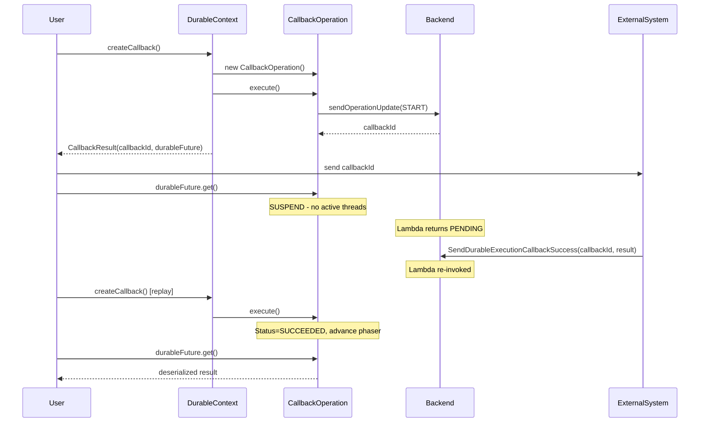

# createCallback Operation - Design Overview

## Overview

This document describes the design for implementing the `createCallback` operation in the AWS Lambda Durable Execution Java SDK. This operation allows durable functions to suspend execution and wait for external systems to respond via AWS Lambda callback APIs.

**Use cases:** Human approval workflows, payment processing, third-party webhooks, long-running external processes.

---

## Execution Flow

### Sequence Diagram



### First Execution

1. User calls `context.createCallback("approval", String.class, config)`
2. CallbackOperation checkpoints with CALLBACK type, START action
3. Backend generates callbackId, returns in response
4. Return `CallbackResult(callbackId, durableFuture)` to user
5. User sends callbackId to external system
6. User calls `durableFuture.get()` → suspends → Lambda returns PENDING
7. OR, in case other work is currently being done, continue to poll in-process

### After External Callback

1. External system calls `SendDurableExecutionCallbackSuccess(callbackId, result)`
2. Lambda re-invoked, replay reaches createCallback()
3. Existing operation found with status SUCCEEDED → complete phaser immediately
4. `durableFuture.get()` returns deserialized result

---

## API Design

### Return Type

Question: Should we do CallbackResult or DurableCallbackResult? I personally prefer DurableCallbackResult as it would be consistent with DurableFuture and is more explicit for end users.

```java
public record CallbackResult<T>(
    String callbackId,
    DurableFuture<T> durableFuture
) {}
```

### Method Signatures

```java
// With name, type, and config
<T> CallbackResult<T> createCallback(String name, Class<T> resultType, CallbackConfig config);

// Convenience overloads
<T> CallbackResult<T> createCallback(String name, Class<T> resultType);
<T> CallbackResult<T> createCallback(Class<T> resultType, CallbackConfig config);
<T> CallbackResult<T> createCallback(Class<T> resultType);

// TypeToken variants for generic types (e.g., List<String>)
<T> CallbackResult<T> createCallback(String name, TypeToken<T> typeToken, CallbackConfig config);
// ... same overload pattern
```

### Configuration

```java
CallbackConfig.builder()
    .timeout(Duration.ofDays(7))           // Max time to wait for callback
    .heartbeatTimeout(Duration.ofMinutes(5)) // Max time between heartbeats
    .build();
```

**Heartbeat:** External system periodically calls `SendDurableExecutionCallbackHeartbeat` to signal it's still working. If no heartbeat within timeout, callback times out (fail fast instead of waiting full timeout).

---

## Terminal States

| Status | Trigger | SDK Behavior |
|--------|---------|--------------|
| SUCCEEDED | External calls `SendDurableExecutionCallbackSuccess` | Return deserialized result |
| FAILED | External calls `SendDurableExecutionCallbackFailure` | Throw `CallbackException` |
| TIMED_OUT | Timeout or heartbeat timeout elapsed | Throw `CallbackTimeoutException` |

---

## Example Usage

```java
public String handleRequest(Input input, DurableContext context) {
    // Create callback and get ID
    var cb = context.createCallback("approval", ApprovalResult.class,
        CallbackConfig.builder()
            .timeout(Duration.ofDays(7))
            .build());
    
    // Send callback ID to external system (e.g., email with approval link)
    context.step("send-email", Void.class, () -> {
        emailService.sendApprovalRequest(cb.callbackId());
        return null;
    });
    
    // Wait for external response (suspends until callback completes)
    ApprovalResult result = cb.durableFuture().get();
    
    return result.approved() ? "Approved!" : "Rejected";
}
```

---

## Testing Support

`LocalDurableTestRunner` will support simulating external callback completion:

```java
// Simulate success
runner.completeCallback(callbackId, resultJson);

// Simulate failure  
runner.failCallback(callbackId, error);

// Simulate timeout
runner.timeoutCallback(callbackId);
```
